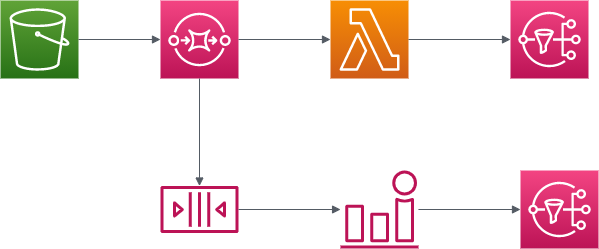

# aws-s3-sqs-lambda-sns

## Overview

This terraform program create AWS resource below image.
S3 object create event send message to SQS, and lambda function pull queue message from SQS and read it, then send success message to SNS.
If lambda failed to run, send message to dead letter queue and cloudwatch metrics alarm detect it. Then, it send failure message to SNS.

## Image

## Usage

- Prepare the SLACK token with correct scope. This program uses conversations.info
  , conversations.history, chat.delete API. To attach correct scope, see the official document.

- Definite the terraform.tfvars file by referring to the terraform.tfvars_sample file.

- Run the `terraform apply` command to create AWS resources.

- Set up SNS subscription if necessary.

- Upload object with prefix to your S3 bucket. Prefix is function_name you described. See S3 Event notifications setting.
